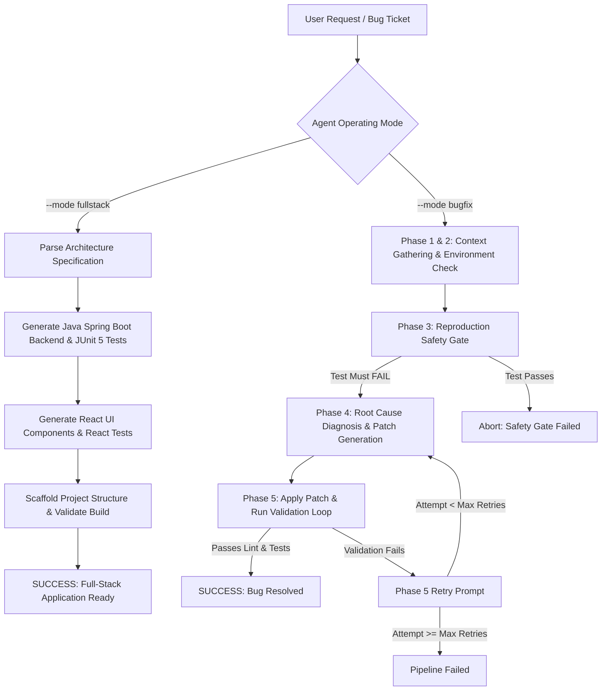

# 🤖 Autonomous Senior Software Engineer & Full-Stack Developer Agent

[](https://www.python.org/)
[](https://docs.pydantic.dev/)
[](https://spring.io/projects/spring-boot)
[](https://react.dev/)
[](LICENSE)

An autonomous, multi-phase AI agent framework powered by **Pydantic v2**, **Stateful Persona Prompts**, and **Structured Output LLM APIs** (Google Gemini & OpenAI). 

The agent operates in dual modes:
1. **🚀 Full-Stack Feature Generator**: Scaffolds production-grade **Java Spring Boot 3** REST APIs (`pom.xml`, `@RestController`, `@Service`, `@Repository`, JPA Entities), **JUnit 5 + Mockito** test suites, **React UI** components, CSS styling, and **React Testing Library** tests from natural language prompts.
2. **🐞 Autonomous Bug Fix Engine**: Executes a 5-phase self-correcting loop (**Reproduction Safety Gate** -> **Root Cause Diagnosis** -> **Unified Git Patching** -> **Validation Retry Loop**) to reproduce and fix codebase bug tickets independently.

---

## 🌟 Key Features

* **Dual Operating Modes**: Switch seamlessly between full-stack application creation (`--mode fullstack`) and codebase bug fixing (`--mode bugfix`).
* **Reproduction Safety Gate**: Forces the agent to write a standalone regression test that *must fail* against the buggy codebase before generating code patches (preventing false-positive fixes).
* **Guaranteed Type Safety & Structured Outputs**: Built using Pydantic v2 schema enforcement to prevent JSON parsing failures and markdown fence issues.
* **Self-Correcting Validation Loop**: Captures test suite/linter console logs on validation failures and feeds them back into the LLM context for iterative retries.
* **Language-Agnostic Patching**: Uses native `git apply` unified diffs with line-ending normalization for multi-language codebases (Python, Java, JavaScript/TypeScript, Go, C#).
* **LLM Provider Agnostic**: Native support for **Google Gemini**, **OpenAI**, or **Offline Mock Mode**.

---

## 📐 Architecture & Execution Flow



---

## 📂 Project Directory Structure

```
.
├── demo_repo/                 # Sample buggy repository for demo runs
├── output_app/                # Target output folder for generated fullstack apps
│   ├── backend/               # Generated Java Spring Boot project (pom.xml, Java sources, JUnit tests)
│   └── frontend/              # Generated React project (package.json, JSX, CSS, React tests)
├── src/
│   ├── agent/
│   │   ├── fullstack_orchestrator.py # Orchestrates Spring Boot + React generation
│   │   ├── llm_client.py           # Structured output LLM client (Gemini/OpenAI/Mock)
│   │   └── orchestrator.py         # Master 5-phase bug resolution loop
│   ├── prompts/
│   │   └── templates.py            # Master system identity & dynamic phase prompt injections
│   ├── runner/
│   │   ├── patch_applier.py        # Git apply diff manager & revert helper
│   │   ├── react_scaffolder.py     # React project layout scaffolder & test runner
│   │   ├── repo_inspector.py       # Codebase inspector & environment detector
│   │   ├── spring_boot_scaffolder.py # Java Spring Boot scaffolder & Maven test runner
│   │   └── test_runner.py          # Subprocess test suite execution runner
│   └── schemas/
│       └── models.py               # Pydantic v2 schema definitions
├── tests/                          # Unit test suite for agent framework
├── main.py                         # Unified CLI entry point
└── requirements.txt
```

---

## ⚡ Quick Start & Installation

### 1. Prerequisites
* Python 3.10+
* Git CLI

### 2. Installation
```bash
# Clone repository
git clone https://github.com/kumar291098/autonomous-engineer-agent.git
cd autonomous-engineer-agent

# Set up virtual environment
py -m venv .venv

# Activate virtual environment (Windows)
.venv\Scripts\activate

# Install dependencies
pip install -r requirements.txt
```

---

## 💻 CLI Usage & Examples

### Option A: Full-Stack App Generation Mode
Generate complete Java Spring Boot 3 backend services, React UI dashboard components, and test suites from a natural language requirement:

```bash
# Set your API Key
set GEMINI_API_KEY=your_gemini_api_key_here

# Run Full-Stack Generation
python main.py --mode fullstack --feature "Food Delivery Order Service with React Dashboard UI and Java Spring Boot REST API" --provider gemini
```

**Output Generated**:
- `output_app/backend/pom.xml` (Maven configuration)
- `output_app/backend/src/main/java/com/app/controller/OrderController.java` (`@RestController`)
- `output_app/backend/src/test/java/com/app/controller/OrderControllerTest.java` (JUnit 5 + Mockito)
- `output_app/frontend/package.json`
- `output_app/frontend/src/App.jsx` (React Dashboard)
- `output_app/frontend/src/App.css` (Responsive CSS)
- `output_app/frontend/src/App.test.jsx` (React Testing Library)

---

### Option B: Autonomous Bug Fix Pipeline Mode
Parse an issue ticket, auto-generate a failing reproduction test, diagnose root cause, write a git patch, and validate with retries:

```bash
# Run Bug Fixer against target repository
python main.py --mode bugfix --repo ./target_repo --issue-title "Null Pointer in Order Calculation" --issue-desc "The calculate function returns x - 1 instead of x + 1" --provider gemini
```

**Sample Output Execution Log**:
```text
=======================================================
[START] Starting Autonomous Agent Pipeline for Issue: Calculation Return Value Bug
=======================================================

[PHASE 1 & 2] Gathering Repo Context & Checking Environment...
   [OK] Discovered 2 files.
   [OK] Build System: python | Test Framework: pytest

[PHASE 3] Reproduction (The Safety Gate)...
   [OK] Generated Reproduction Test: tests/test_reproduction.py
   Running reproduction test against buggy codebase...
   [OK] Safety Gate PASSED: Test FAILED as expected (exit_code=1). Bug reproduced!

[PHASE 4] Diagnose and Patch (Attempt 1)...
   [OK] Root Cause Diagnosis: Fix calculation function in sample_app.py to add 1 instead of subtracting 1.
   [OK] Suspected Files: ['sample_app.py']

[PHASE 5] Applying Patch & Running Validation Loop...

--- Validation Attempt 1/3 ---
   [OK] Patch applied cleanly to workspace.
   [SUCCESS] Patch passed all tests and linters!

=======================================================
[RESULT] Pipeline Execution Result: SUCCESS
=======================================================
Diagnosis Root Cause: Fix calculation function in sample_app.py to add 1 instead of subtracting 1.
Patch Diff:
diff --git a/sample_app.py b/sample_app.py
--- a/sample_app.py
+++ b/sample_app.py
@@ -1,4 +1,4 @@
 def calculate(x: int) -> int:
     """Calculates incremented value."""
-    # BUG: Subtracts 1 instead of adding 1
-    return x - 1
+    # FIXED: Adds 1
+    return x + 1
```

---

## 🧪 Testing the Agent Framework

Run the comprehensive unit test suite:
```bash
pytest tests/
```

```text
============================= test session starts =============================
platform win32 -- Python 3.12.10, pytest-9.1.1, pluggy-1.6.0
collected 7 items

tests\test_fullstack.py ...                                              [ 42%]
tests\test_prompts.py ..                                                 [ 71%]
tests\test_schemas.py ..                                                 [100%]

============================= 7 passed in 0.25s ==============================
```

---

## 📄 License

Distributed under the MIT License. See `LICENSE` for more information.
