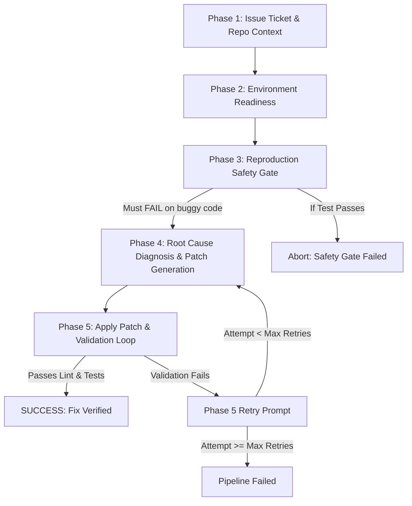

# Autonomous Senior Software Engineer Agent Framework

An autonomous, multi-phase bug-resolution agent framework built with Python, Pydantic, and stateful persona prompts. The agent operates within a controlled execution loop to independently reproduce, diagnose, patch, and validate software bug tickets.

## Architecture & Pipeline Phases



### Key Features
1. **Stateful Persona Prompts**: Standardized Master Identity with dynamic `[CURRENT TASK]` phase injections.
2. **Reproduction Safety Gate**: Forces the agent to write a standalone regression test that *fails* on the buggy codebase before proceeding.
3. **Structured Outputs**: Guarantees typed Pydantic models (`ReproductionTest`, `PatchSubmission`, `Diagnosis`, `ValidationResult`) for strict pipeline parsing.
4. **Validation & Retry Loop**: Automatically captures test/linter logs on failed patch validation and feeds them back into the LLM context for self-correction.

---

## Directory Structure

```
├── demo_repo/               # Sample buggy repository for demo runs
├── src/
│   ├── agent/
│   │   ├── llm_client.py    # Structured output LLM client (Gemini/OpenAI/Mock)
│   │   └── orchestrator.py  # Master 5-phase execution loop
│   ├── prompts/
│   │   └── templates.py    # Master system prompt & dynamic phase injections
│   ├── runner/
│   │   ├── patch_applier.py # Git apply diff applier and revert helper
│   │   ├── repo_inspector.py# Inspects directory structure and source files
│   │   └── test_runner.py  # Test suite and reproduction test runner
│   └── schemas/
│       └── models.py        # Pydantic schema models
├── tests/                   # Unit test suite
├── main.py                  # CLI entry point
└── requirements.txt
```

---

## Quick Start

### 1. Install Dependencies
```bash
py -m venv .venv
.venv\Scripts\pip install -r requirements.txt
```

### 2. Run Pipeline against Demo Repository
```bash
.venv\Scripts\python main.py --repo ./demo_repo --provider mock
```

### 3. Run with Google Gemini / OpenAI
```bash
set GEMINI_API_KEY=your_key_here
.venv\Scripts\python main.py --repo ./target_repo --provider gemini
```

### 4. Run Unit Tests
```bash
.venv\Scripts\pytest tests/
```
